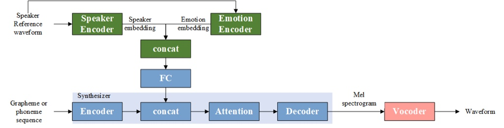

# Emotion Voice Cloning

### What is this?
It is an improved version of [Real-Time-Voice-Cloning](https://github.com/CorentinJ/Real-Time-Voice-Cloning) which can generate emotional audio outputs based on the reference audio.<br>
THe architecture of the emotion voice cloning system is as follows:<br>

Based on the architecture of real-time voice cloning, which is an encoder-synthesizer-vocoder pipeline, we add an emotion encoder to learn the emotion representation of the speaker prompt. The output of the emotion encoder is an emotion embedding. Then we concatenate the speaker embedding and the emotion embedding and reduce the dimension of the joint embedding. The final joint embedding is then plugged into the Tacotron2 model.<br>
Since, we want to take advantage of the pretrained parameters of the real-time voice cloning checkpoints, we load the pretrained model, initialize the parameters of the fully connected layer added to the synthesizer, and continue training the Tacotron2 model. 

## Installation
1. Install [ffmpeg](https://ffmpeg.org/download.html#get-packages). This is necessary for reading audio files.

2. Create a new conda environment with 
```
conda create -n rtvc python=3.9
```
3. Install [PyTorch](https://download.pytorch.org/whl/torch_stable.htmlhttps://pytorch.org/get-started/previous-versions/).  Pick the proposed CUDA version if you have a GPU, otherwise pick CPU.
```
conda install pytorch==1.13.1 torchvision==0.14.1 torchaudio==0.13.1 pytorch-cuda=11.6 -c pytorch -c nvidia
```

4. Install the remaining requirements with 
```
pip install -r requirements.txt
```

5. Install spaCy model en_core_web_sm by 
`python -m spacy download en_core_web_sm`


## Training

### Emotion Encoder
The source code and the training procedures are [here](https://github.com/liuhaozhe6788/TIM-Net_SER). The training checkpoint should be in saved_models/default/INTERSECT_46_dilation_8_dropout_05_add_esd_npairLoss.

### Speaker Encoder 

**Download dataset：** 

1. [LibriSpeech](https://www.openslr.org/12): train-other-500 for training, dev-other for validation
(extract as <datasets_root>/LibriSpeech/<dataset_name>)

2. [VoxCeleb1](https://mm.kaist.ac.kr/datasets/voxceleb/): Dev A - D for training, Test for validation as well as the metadata file `vox1_meta.csv` (extract as <datasets_root>/VoxCeleb1/ and <datasets_root>/VoxCeleb1/vox1_meta.csv)

3. [VoxCeleb2](https://mm.kaist.ac.kr/datasets/voxceleb/): Dev A - H for training, Test for validation
(extract as <datasets_root>/VoxCeleb2/)

**Encoder preprocessing：** 
```
python encoder_preprocess.py <datasets_root>
```

**Encoder training：** 

it is recommended to start visdom server for monitor training with
```
visdom
```
then start training with
```
python encoder_train.py <model_id> <datasets_root>/SV2TTS/encoder
```
### Synthesizer

**Download dataset：** 
1. [LibriSpeech](https://www.openslr.org/12): train-clean-100 and train-clean-360 for training, dev-clean for validation (extract as <datasets_root>/LibriSpeech/<dataset_name>)
2. [LibriSpeech alignments](https://drive.google.com/file/d/1WYfgr31T-PPwMcxuAq09XZfHQO5Mw8fE/view?usp=sharing): merge the directory structure with the LibriSpeech datasets you have downloaded (do not take the alignments from the datasets you haven't downloaded else the scripts will think you have them)
3. [VCTK](https://datashare.ed.ac.uk/handle/10283/3443): used for training and validation

**Synthesizer preprocessing:** 
```
python synthesizer_preprocess_audio.py <datasets_root>
python synthesizer_preprocess_embeds.py <datasets_root>/SV2TTS/synthesizer
```

**Synthesizer training:** 
```
python synthesizer_train.py <model_id> <datasets_root>/SV2TTS/synthesizer --use_tb
```
if you want to monitor the training progress, run
```
tensorboard --logdir log/synthesizer --host localhost --port 8088
```
### Vocoder

**Download dataset：** 

The same as synthesizer. You can skip this if you already download synthesizer training dataset.

**Vocoder preprocessing:** 
```
python vocoder_preprocess.py <datasets_root>
```

**Vocoder training:** 
```
python vocoder_train.py <model_id> <datasets_root> --use_tb
```
if you want to monitor the training progress, run
```
tensorboard --logdir log/vocoder --host localhost --port 8080
```
**Note:**

Training breakpoints are saved periodically, so you can run the training command and resume training when the breakpoint exists.

## Inference 

**Terminal:** 
```
python demo_cli.py
```
First input the audio file paths, then input the text message. The attention alignments and mel spectrogram are stored in syn_results/. The generated audio is stored in out_audios/.

**Run GUI demo:**

```
python demo_toolbox.py
```
## Speaker Encoder Dimension reduction visualization
**Download dataset:** 

[LibriSpeech](https://www.openslr.org/12): test-other
(extract as <datasets_root>/LibriSpeech/<dataset_name>)

**Preprocessing:** 
```
python encoder_test_preprocess.py <datasets_root>
```

**Visualization:**
```
python encoder_test_visualization.py <model_id> <datasets_root>
```
The results are saved in dim_reduction_results/.

## Emotion Encoder Dimension reduction visualization
**Download dataset:** 

[ESD_test](https://drive.google.com/drive/folders/1dt5iGKrLnhwkqhIltHR-qtksMFXhFkXp):
(extract as `emotion_encoder/MFCC/ESD_test.npy`)

**Visualization:**
```
python emotion_embed_visualization.py
```
The results are saved in dim_reduction_results/.

## Pretrained models
You can download the pretrained model from [this](https://drive.google.com/drive/folders/11DFU_JBGet_HEwUoPZGDfe-fDZ42eqiG) and extract as saved_models/default

## Demo results
Audio results are [here](https://github.com/liuhaozhe6788/voice-cloning-collab/tree/add_emotion).
